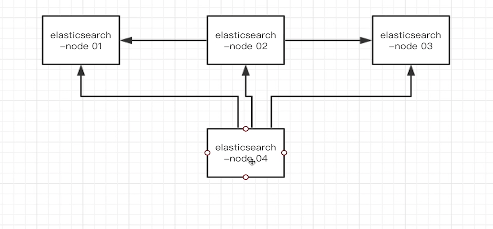
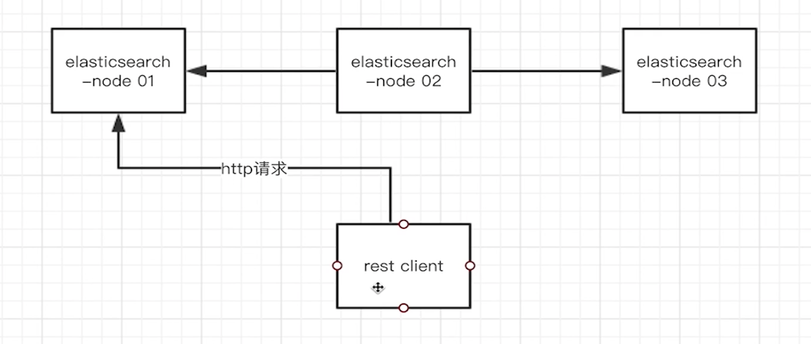

## Java搜索接入的两种方式
1、node接入 基于node client

与node1、node2、node3是对等的，他也是集群中的一个node节点

- 缺点：过于重量级

2、transport接入 基于transport client
以一个 transport 通信节点的方式，使用transport协议发送数据。

3、http 接入(ElasticSearch7后官方推荐的方式) 基于rest client
